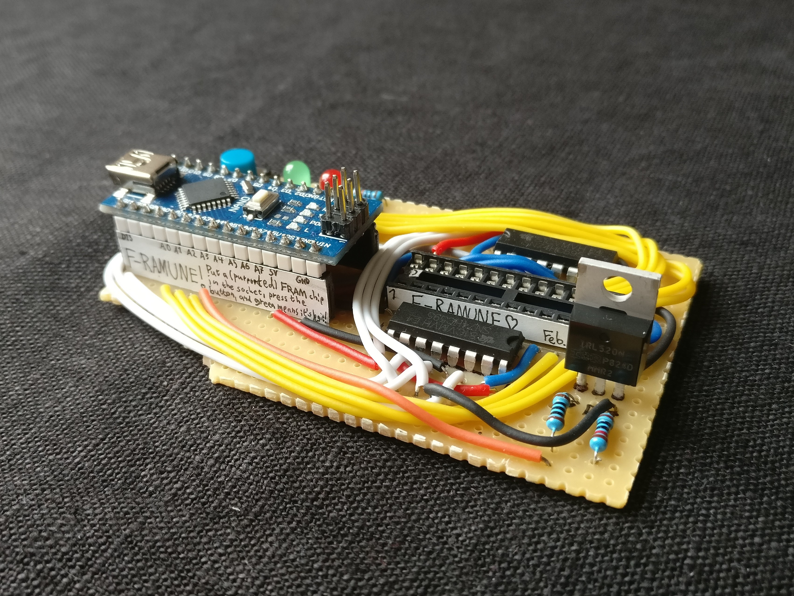

# F-Ramune

F-Ramune is a device that lets you test and program 28-pin FRAM chips (e.g. the FM1808 family)! It lets you:

* Test that a chip is genuine FRAM!
* Test that all of the memory cells of an FRAM chip work!
* Identify a memory chip (size, non-volatility, etc.)
* Read from an FRAM chip!
* Write to an FRAM chip!

It features a reprogrammable pushbutton that lets you quickly test chips – out of the box, it's set to check that a chip is 32 KiB of genuine FRAM in full working order – and a serial interface with accompanying software that lets you program your memory chips from your PC.

I made this to test FM1808s of dubious (i.e. cheap Chinese) origin so that the Game Boy cartridge immortalization mod (link to come) would become more feasible and accessible. I expect that to be the main use of F-Ramune, but it's written in an extensible fashion – if you want to test or program FRAM (or SRAM!) in a different form factor or pinout, not much needs to be changed.

## Getting started

Since F-Ramune is a physical device, you'll first need to build that device. Instructions for this can be found in the [hardware directory](hardware) of the repo. At the moment, there's no PCB version, so it's fairly involved – you have to manually route it on stripboard or breadboard – but it's more than doable.

Once you've built the device, you need to upload the firmware to it. For user-friendliness, F-Ramune's firmware is Arduino-based! Open `software.ino` (in the [`software` directory](software)) in the [Arduino IDE](https://www.arduino.cc/en/main/software), set the board to "Arduino Nano", and click the "upload" button. Bam! Your F-Ramune is now ready to go!

## How to test a chip

Put the chip you want to test in the socket. Press the button to test the chip. Out of the box, upon pressing the button, the LEDs will possibly flash back and forth a bit while testing, and finally indicate:

* **Red** if the chip is 32 KiB of genuine FRAM.
* **Red and green** if the chip is genuine, but faulty memory cells were found.
* **Green** if the chip is 32 KiB of genuine FRAM.

The function of the button can be reprogrammed in [`software.ino`](software/software.ino), if you'd like to check for other traits.

## How to program or analyze a chip

Plug the F-Ramune Arduino into your PC, and put the chip you want to test in the socket. Using the command-line program `framune.py` (found in the `software` directory; requires [Python 3](https://www.python.org/downloads/)) , you can read from, write to, and analyze the properties of the chip. Run `framune.py --help` for details.

## Cool!

F-Ramune is just one part of a larger project, and it's fairly niche, so my instructions here are more terse than they usually are. But fear not! If you have any questions, there are any issues, or you just want to talk, you can contact me in the following ways:

* [@obskyr](https://twitter.com/obskyr) on Twitter, or
* [E-mail](mailto:powpowd@gmail.com) me!

For a quick response, writing to me on Twitter is your best bet. If you built F-Ramune, especially, I would *love* to hear about it!

Enjoy! ☆
