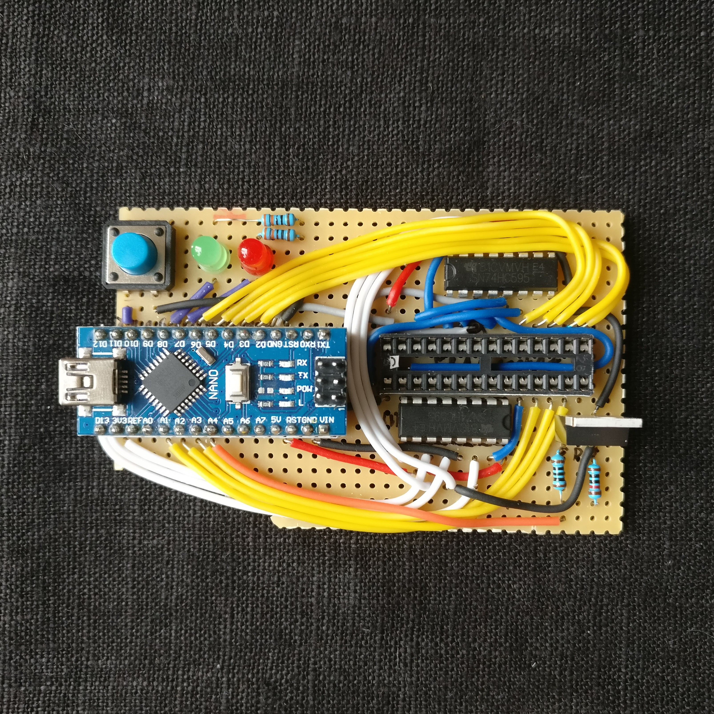
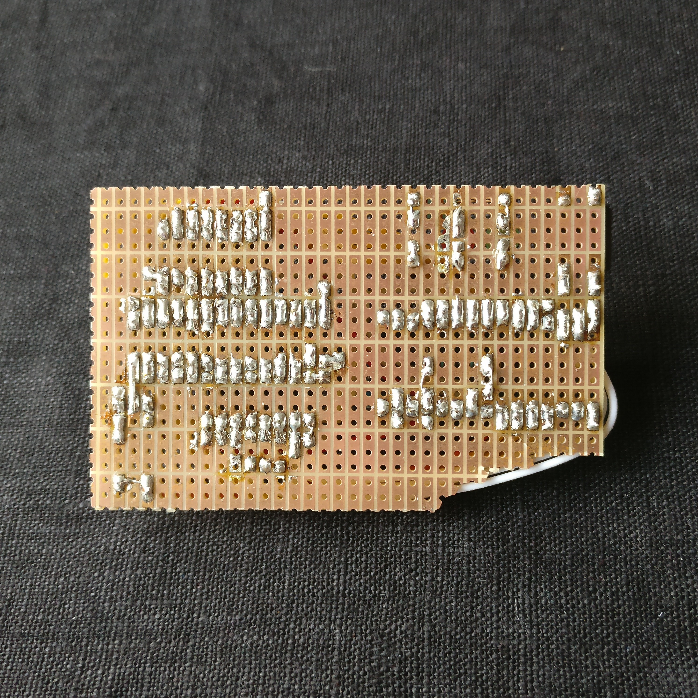
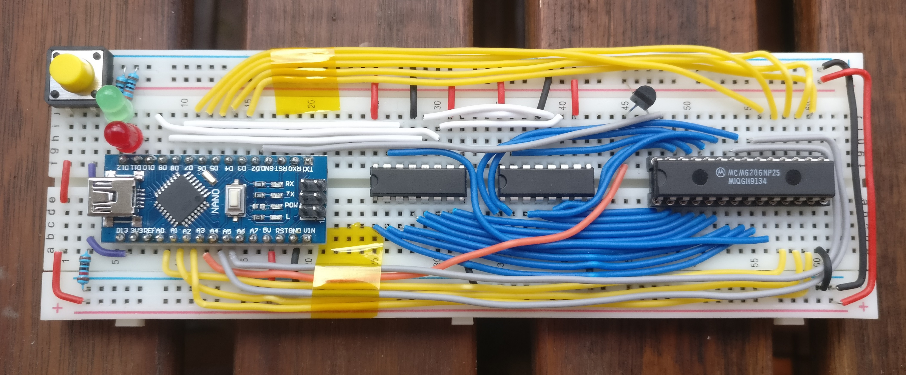

# The F-Ramune hardware

As of yet, there's no PCB version of F-Ramune, but here are some instructions for building it on stripboard or breadboard!

The bill of materials is as following:

| Part                             | Description               | Number required |
| ----------------------------     | ------------------------- | --------------- |
| Arduino Nano                     |                           | 1               |
| ZIF Socket with DIP-28 footprint | To fit SMD parts a [SOIC-28 ZIF socket](https://www.adafruit.com/product/1281). To also be compatible with DIP chips, a DIP-28 ZIF socket can be used as the bottom layer in a… socket cake. | 1
| 74HC595                          | 8-bit SIPO shift register | 2               |
| IRL520N                          | N-channel MOSFET          | 1               |
| Green LED                        |                           | 1               |
| Red LED                          |                           | 1               |
| Pushbutton                       |                           | 1               |
| 10 kΩ resistor                   |                           | 1               |
| 100 Ω resistor                   |                           | 1               |
| 330 Ω resistor                   |                           | 2               |

## Tips for all versions

The schematic specifies the transistor to be an IRL520N, but **any N-channel MOSFET with an ID** (drain current) **of 200 mA or higher, a VGS** (gate threshold) **of 4.5 V or lower and an RDS(ON)** (on-resistance) **of 1 Ω or lower works**. The VGS requirement is for ~5 V logic signals to work. The RDS(ON) of 1 Ω is calculated based on an assumed max supply current for the memory chip of 200 mA and a max allowable voltage drop of 0.2 V (0.2 A / 0.2 V = 1 Ω). Using a more realistic max supply current of 140 mA and/or a more forgiving voltage drop limit, you can arrive at a higher max RDS(ON), and it'll probably still work fine – albeit with less leeway. If you've got MOSFETs lying around, check out their datasheets and see if they're reasonably close to the requirements!

<!-- For the eventual PCB version:
## PCB

### Tips for the PCB version

* The schematic specifies an 18.432 MHz crystal, but if you've got a 16 MHz crystal lying around, you can use that – it'll just make the serial communication less reliable (0% timing error for 18.432 MHz vs. ~3.5% error for 16). This might still work fine, but it's possible it'll cause trouble with some serial adapters. 
-->

## Stripboard

There's no layout diagram for building F-Ramune on stripboard (since apparently there's no good digital stripboard design program!?), but it's a very reliable and permanent way to build it, so why not give it a shot? Using [the schematic](breadboard-schematic.png), you can put together something most respectable. Here's my finished stripboard:

  
  

Don't make the mistake I did and leave too little space for the socket – preferably, solder in whatever socket you're using *before* any wires. Measure twice, cut once, y'know?

## Breadboard

I wouldn't recommend breadboarding F-Ramune – breadboards are unreliable, and the device uses high-speed signals and has to be quite picky with voltages. If you would like to try, though, the breadboard schematic and layout can be found in `breadboard.fzz`, which is a [Fritzing](http://fritzing.org/) file. Either install Fritzing and open that file, or take a gander at the image versions of [the schematic](breadboard-schematic.png) and [the layout diagram](breadboard.png). The layout is somewhat optimistically routed, so some spur-of-the-moment re-routings may need to be done as space gets tight. Here's the finished product:

### Tips for breadboarding F-Ramune

* Use a high-quality breadboard! Although FRAM chips consume next to no current, SRAM chips can consume up to 140 mA. Channeling that much via a breadboard with poor connections and bizarrely resistive power rails is a fool's errand – I learned this the hard way.
* If you're using a breadboard of lesser quality, keep the following in mind:
    * When you insert a wire or a pin, make sure it feels like it's being gripped (and before you insert an IC, check those holes with a wire first). If it doesn't, that hole may be intermittent or flat-out broken. You can remedy this by using a different hole on the same row, replacing the strip on that particular row, or [jamming a resistor leg into it](https://twitter.com/obskyr/status/1096047043683012609).
    * You may need to run wires directly to the memory chip's V+ and ground pins from the holes right by the Arduino, since going via the power rails might prove too high-resistance. Adding more bridge wires (like the ones on the far right in the breadboard diagram) may also help, albeit not as much.
* The pins on a TO-220 package such as the MOSFET here are highly destructive to breadboard holes. Use a gripping implement to turn the thin part of the pins 45–90° before inserting it, so the pins don't get gripped lengthwise and bend the breadboard's connectors out of shape.
